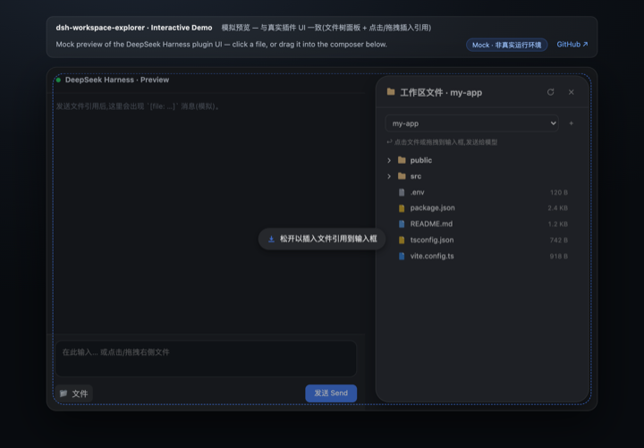
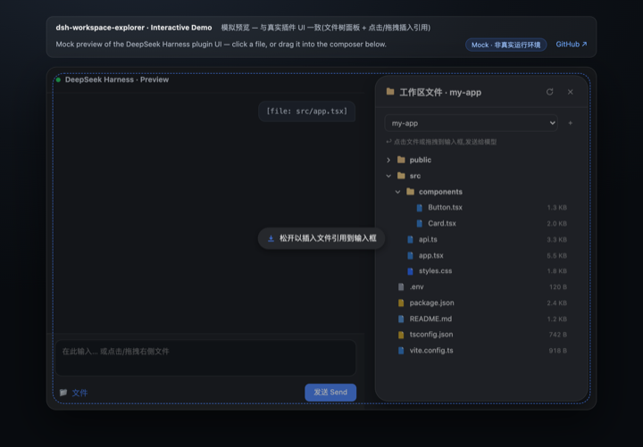

# dsh-workspace-explorer

**[English](README.md)** | [中文](README.zh.md)

[](LICENSE)
[](https://www.npmjs.com/package/@jiyr0119/dsh-workspace-explorer)
[](https://www.npmjs.com/package/@jiyr0119/dsh-workspace-explorer)
[](https://Jiyr0119.github.io/dsh-workspace-explorer/)
[](https://github.com/Jiyr0119/dsh-workspace-explorer)

> A workspace file explorer for the DeepSeek Harness Web UI: a **file-tree button in the session header** opens an animated popup showing the current workspace's directory tree — click or drag a file to send its reference to the model.

Inspired by the VS Code / Cursor project tree, filling the gap of a missing directory view in DSH after workspaces are added.

## 🖥 Live Demo (GitHub Pages)

🔗 [**Try the interactive preview**](https://Jiyr0119.github.io/dsh-workspace-explorer/)

> An interactive **mock** of the panel UI — no DeepSeek Harness needed to try it. The real plugin runs inside the Harness web UI as a dynamic Cordis plugin.


<details>
<summary><b>Screenshots</b> · 截图</summary>






</details>

## Features

- 📂 **Animated popup** — a **file-tree icon** in the session header (beside the session log button) opens a floating panel with a spring-like fade/scale-in animation; the popup is measured live to sit **between the session header and the composer** (the chat area's right side), so it never covers the input box
- 🗂 **Top tab bar** — click at the top of the panel to switch between Files and Settings; the Settings page tunes behavior live (hide noise dirs, show sizes, reference format, preview lines, panel width) and mirrors into DSH Settings → Workspace Explorer
- 🗂 **Lazy-loading tree** — directories load on demand; noise dirs (`node_modules`, `.git`, `dist`, `__pycache__`, …) are hidden automatically
- 🎨 **File-type icons** — filled, color-coded document badges per extension (TS / JS / Python / JSON / Markdown / image / config / shell, …); amber folders that brighten when expanded
- 🖱 **Click to insert** — click a file row to append a `[file: relative-path]` reference to the composer; after sending, the model resolves it with its `read` tool
- 🖱 **Drag & drop** — drop a file into the composer to insert at the caret (fullscreen dashed hint); dropping elsewhere appends to the end
- 🌓 **Theme-aware** — built entirely on DSH's `--dsw-alias-*` design tokens; adapts to light/dark with a native dialog look (16px radius, lv3 shadow)
- 🔍 **Search & filter** — filter files by name across loaded directories (flat result list with a match count)
- 👁 **Inline preview** — peek the first 60 lines of any text file; insert the reference, or paste the full content for small files (≤ 32 KB)
- 🌐 **i18n** — zh/en dictionaries registered through DSH's locale service; the panel follows the DSH UI language

## Quick Start

### Installation & usage

**Way 1 · Dynamic plugin paste — full UI (recommended)**
A *dynamic Cordis plugin*: no build step, no config changes.

1. In the DSH web UI, have an agent run `cordis_define` (or use the dynamic plugin panel) with `idPrefix` `wsex`.
2. Paste the whole [`dynamic/host.js`](./dynamic/host.js) into **Host code**.
3. Paste the whole [`dynamic/client.js`](./dynamic/client.js) into **Client code**.
4. `cordis_run` to activate; authorize on the Run card when it first appears.
5. Click the 🌲 **file-tree icon** in the session header → expand directories → click a file, or drag it into the composer, then send.

**Way 2 · npm source package**
`npm install @jiyr0119/dsh-workspace-explorer` — the package ships `dynamic/host.js` / `dynamic/client.js` for the Way-1 paste flow, with semver releases.

**Way 3 · Storefront (`dsh plugin add` / dsh-market) — native install (v0.4.0)**
`dsh plugin --profile web add -w @jiyr0119/dsh-workspace-explorer@latest` (or the market one-click button). The package ships a native host half (`lib/index.js`, webServer JSON routes incl. `/dsh-we/api/config`) **and** a browser bundle (`lib/client.js` via `dsh.plugin.json`) with the full interaction — animated popup from the session-header file-tree icon + a live settings page. The build passes typecheck and the tsdown bundle; the dynamic paste flow (Way 1) remains the zero-build option.

> ℹ️ **pnpm note**: modern pnpm (9/10) refuses to add a dependency at the workspace root (`ERR_PNPM_ADDING_TO_ROOT`), hence the `-w` flag above. Alternative: create `~/.dsh/profiles/web/.npmrc` containing `ignore-workspace-root-check=true`.

> ⚠️ **Common misconception**: a listing alone never auto-installs anything — users still click install. With Way 3 the panel now appears after install (native bundle); before 0.2.0, storefront installs only mounted the host entry with no UI.

See [`docs/install.md`](./docs/install.md) for details.

### Usage

1. Click the 🌲 **file-tree icon** at the top of the session header (right side, beside the session log button) to open the popup.
2. Expand directories to browse files.
3. Click a file, or drag it into the composer, then send.
4. Use the **Settings** tab at the top of the popup (or DSH Settings → Workspace Explorer) to adjust panel behavior.

## Project Structure

```
dsh-workspace-explorer/
├── README.md             # Docs — English (default)
├── README.zh.md          # Docs — 中文
├── LICENSE               # MIT
├── CHANGELOG.md          # Release notes
├── manifest.json         # Plugin metadata
├── package.json          # Repo metadata (not an npm package)
├── demo/
│   ├── index.html        # Interactive mock preview (GitHub Pages)
│   └── preview.gif       # Demo animation (README)
├── .github/
│   └── workflows/
│       └── pages.yml     # Deploys demo/ to GitHub Pages
├── docs/
│   ├── install.md        # Install guide
│   ├── native-package.md # Native DSH package roadmap (upstream PR sketch)
│   └── publish.md        # Publishing workflow (GitHub + npm)
├── src/
│   ├── index.ts          # Native host half: webServer JSON routes (/dsh-we/api/*)
│   └── client/
│       └── index.tsx     # Native client half: popup + tree + icons + drag & drop
├── dynamic/
│   ├── host.js           # Dynamic paste host half: fs listing + ws-tree.* RPC
│   └── client.js         # Dynamic paste client half: popup + tree + icons
└── lib/                  # Built artifacts (lib/index.js + lib/client.js)
```

## Implementation Notes

| Capability | Mechanism |
|---|---|
| Directory listing | Host `fs.resolve` / `fs.listDir` |
| Host→Client RPC | `harness.handle('ws-tree.list' / 'ws-tree.peek')` ↔ `host.call(...)` |
| Popup | `shell.overlay` slot (`useWorkspaces` / `useSessions`), position measured between session header & composer |
| Toggle button | `conversation.session.header.utilities` slot (file-tree icon) |
| Composer write | `conversation.input.dock` → `inputActions.setDraft` |
| Drag & drop | HTML5 DnD; native caret insert in the textarea, append elsewhere |
| Theming | `--dsw-alias-*` CSS variables (light/dark) |

## Version

Current version **v0.4.0** — animated popup opened from a session-header file-tree icon, positioned between the header and the composer; full feature set (tree, search, preview, click/drag references, settings, i18n).
See [CHANGELOG.md](./CHANGELOG.md) for release notes.

## Roadmap

**Done ✅**

- [x] v0.1 core: right-side file tree, click / drag-to-composer references, native DSH look
- [x] Search & filter; inline preview (first 60 lines); content insertion for small files (≤ 32 KB)
- [x] i18n (zh/en via the DSH locale service, follows the DSH UI language)
- [x] Demo language toggle, GitHub Pages preview, demo GIF, storefront screenshots
- [x] npm source package + `dsh.bundle` contract + awesome-dsh-plugin PR ([#1158](https://github.com/awesome-dsh-plugin/awesome-dsh-plugin/pull/1158), pending merge)

**Track A — UX polish**

- [ ] Multi-select & batch insert file references (Shift / Cmd)
- [ ] Draggable / resizable panel that remembers position & width
- [ ] Full keyboard navigation (↑↓ to move, Enter to insert, Esc to close)
- [ ] Path actions: copy path, reveal in the OS file manager

**Track B — Productivity**

- [ ] Content search across loaded dirs (host-side grep)
- [ ] Recent files / favorites
- [ ] Paginated preview for large files (next / previous page)
- [ ] File operations (rename / delete / new, under the fs permission fence)

**Track C — Ecosystem & distribution**

- [x] npm `@jiyr0119/dsh-workspace-explorer` (v0.1.1 publishing)
- [x] awesome-dsh-plugin listing (PR #1158)
- [ ] Native DSH package (`@Remote` namespace; needs upstream support) — see [`docs/native-package.md`](./docs/native-package.md)
- [ ] dsh-genie hardened install (host-side persistence)
- [ ] CI: lint + e2e + automated release

**Track D — Quality & maintainability**

- [ ] Virtual scrolling (huge directories)
- [ ] Light / dark theme regression checks
- [ ] Playwright e2e for the demo and the real plugin

## License

[MIT](./LICENSE)
